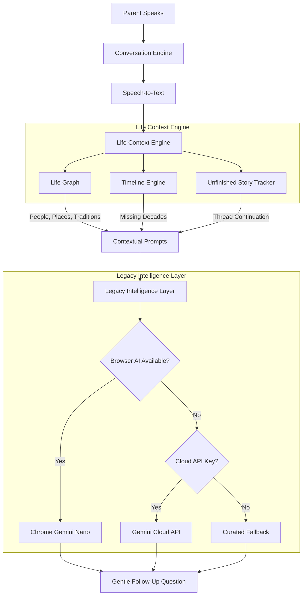

# Life Graph Architecture

## 1. Vision
My Parents' Story is not just a questionnaire or an AI memoir app. It is a **Digital Family Historian** powered by a **Life Graph**.

Rather than retrieving isolated "memories," the system explores the interconnected web of a person's life—their relationships, the places they've lived, the traditions they've kept, and the lessons they've learned. The goal is to progressively map out a complete timeline and relational network, seamlessly generating an intimate, comprehensive legacy.

---

## 2. The Life Graph Model

The Life Graph expands the concept of "Story Seeds" into a multi-dimensional graph of interconnected nodes.

### 2.1 Nodes (Entities)
Every time a story is told, the engine extracts and updates nodes in the Life Graph:
- **People:** Family members, friends, mentors.
- **Places:** Hometowns, villages, vacation spots, childhood homes.
- **Events (Historical & Personal):** Weddings, wars, graduations, migrations.
- **Objects:** Heirlooms, first cars, childhood toys.
- **Traditions & Recipes:** Holiday rituals, secret family recipes, Sunday routines.
- **Lessons & Values:** Core philosophies, advice, regrets.

### 2.2 Edges (Relationships)
Nodes are inherently connected:
- A *Person* (Grandmother) is linked to a *Place* (Village) and a *Tradition* (Making Laddoos for Diwali).
- When a parent mentions "Diwali," the engine can traverse the graph to ask about the Grandmother or the Laddoos, creating a profoundly human conversational continuity.

---

## 3. Expanded Metadata: Memory Types

To support the Life Graph, memories must be classified beyond their emotional tone or importance. Every memory will include a `memoryType`:

```dart
enum MemoryType {
  story,
  advice,
  lifeLesson,
  tradition,
  recipe,
  historicalEvent,
  funnyMemory,
  regret,
  dream,
  achievement,
  loss
}
```

**Why this matters:** When compiling the final memoir, the system can dynamically generate beautiful, structured chapters like "Family Recipes & Traditions" or "Lessons Learned" without having to ask the user a dedicated set of questions. The system already knows.

---

## 4. Life Context Engine (Formerly Memory Retrieval)

The `MemoryRetriever` is now the **Life Context Engine**.

Its responsibilities extend far beyond searching for keyword overlaps. The Life Context Engine is responsible for:
1. **Finding Related Stories:** Surfacing memories that share nodes (People, Places, Themes) to provide context to the Conversation Engine.
2. **Identifying Missing Chapters:** Spotting gaps in the Life Graph (e.g., "We know a lot about childhood, but nothing about the 1980s").
3. **Surfacing Unfinished Stories:** Retrieving memories that were briefly mentioned but never fully explored. (e.g., *"Earlier you mentioned you almost became a pilot. Would you like to tell me what happened?"*)
4. **Maintaining Continuity:** Ensuring the conversation feels like a continuous, multi-day dialogue with a human historian, rather than isolated Q&A sessions.

---

## 5. Timeline Engine

A dedicated layer within the Life Context Engine that maps memories chronologically.
- **Chronological Mapping:** Every memory is assigned an estimated year or decade.
- **Gap Detection:** The Timeline Engine identifies decades with zero stories and gently nudges the Conversation Engine to ask about those eras.

---

## 6. System Architecture Diagram



---

## 7. Next Implementation Steps (Completed V3)

1. **Rename Components:** Refactor `MemoryRetriever` to `LifeContextEngine`.
2. **Expand Data Models:** Add `MemoryType`, `decade`/`year`, and `isUnfinished` to the `Memory` model.
3. **Update Generation Prompts:** Modify `BrowserConversationEngine` and `CloudConversationEngine` prompts to extract these new fields.
4. **Timeline Logic:** Implement chronological gap detection in the Life Context Engine.

---

## 8. Future Vision: V4 (The Oral-History Platform)

To complete the transition from a memoir app to a **personal oral-history platform**, the following architectural evolutions are planned for the future:

### 8.1 Normalized Entities
Move beyond storing metadata arrays within memories, and transition to normalized **Entities** with unique identifiers: `Person`, `Place`, `Event`, `Object`, `Tradition`, `Recipe`, `Lesson`, `Achievement`, `Relationship`. This unlocks archivist-level querying (e.g., "Show every story about Grandma").

### 8.2 Confidence Scores
Every extracted entity will include a confidence score (e.g., `confidence: 0.97`). Low-confidence extractions will require reinforcement across multiple stories before they are heavily utilized in future prompts, ensuring the Life Graph remains pristine.

### 8.3 Relationship Timeline
Rather than just a chronological timeline of events, the system will maintain a **Relationship Timeline** tracking the evolution of connections (e.g., `Father -> Mentor -> Business Partner -> Best Friend`).

### 8.4 Legacy Index
Compute lightweight signals after every story (Completeness, Emotional Richness, Historical Significance) to build a **Legacy Index**. This guides future conversations organically, prioritizing stories that maximize the legacy's depth.

### 8.5 Independent Memoir Generation
Decouple the memoir output from the conversation entirely:
`Life Graph -> Legacy Index -> Story Selection -> Chapter Composer -> Book Designer -> PDF`
This allows for infinite regeneration of the legacy into different formats (printed books, interactive timelines, searchable archives, etc.) without altering the underlying raw data.
